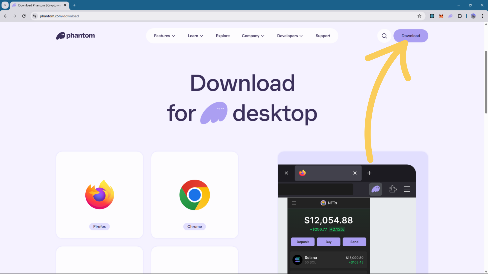

# Solana Token Launchpad 

Web app designed to demonstrate the full lifecycle of deploying **SPL Tokens** on the Solana Blockchain.
This project works on devnet, using **Token_Program_2022** [TokenkegQfeZyiNwAJbNbGKPFXCWuBvf9Ss623VQ5DA](https://solscan.io/account/TokenkegQfeZyiNwAJbNbGKPFXCWuBvf9Ss623VQ5DA?cluster=devnet/) , which helps to add metadata to the token.

---

## 📸 How to Use the App

Make sure you have phantom downloaded in your extensions and have some [Devnet_Solana](https://faucet.solana.com/) in it.

### Step 1: Connect Your Wallet
Click the "Select Wallet" button in the top right corner. Ensure your wallet (Phantom/Backpack) is set to **Solana Devnet**.

*(Place your screenshot here showing the wallet button)*

### Step 2: Define Your Token
Enter the **Name**, **Symbol**, and **Initial Supply** for your token.

*(Place your screenshot here showing the form filled out)*

### Step 3: Upload Metadata
Select an image for your token. The app will automatically upload this to **IPFS** (InterPlanetary File System) to create a permanent, decentralized link.

*(Place your screenshot here showing the image preview)*

### Step 4: Launch & Sign
Click **Create Token**. Your wallet will pop up asking you to sign the transaction. This mints the token and sends the supply to your wallet.

*(Place your screenshot here showing the 'Token Deployed' success popup)*

---

### **Libraries**
* **`@metaplex-foundation/umi`**: The core framework for Solana interactions.
* **`@metaplex-foundation/umi-bundle-defaults`**: Provides default plugins (Http, Http2, etc.) for connecting to the Solana network.
* **`@metaplex-foundation/mpl-token-metadata`**: Handles the creation of Fungible Assets, metadata attachment, and minting logic (Token-2022 compatible).
* **`@metaplex-foundation/umi-signer-wallet-adapters`**: Bridges the Umi framework with the standard Solana Wallet Adapter to allow user signing.

## 🛠️ Tech Stack

* **Frontend:** React.js + Vite
* **Blockchain SDK:** Metaplex Umi & MPL Token Metadata
* **Token Standard:** Token-2022 Program
* **Storage:** Pinata (IPFS)
* **Styling:** CSS3 (Glassmorphism)

---

## ⚠️ Disclaimer

This is a **Devnet** project for educational purposes. Tokens created here do not have real financial value.

